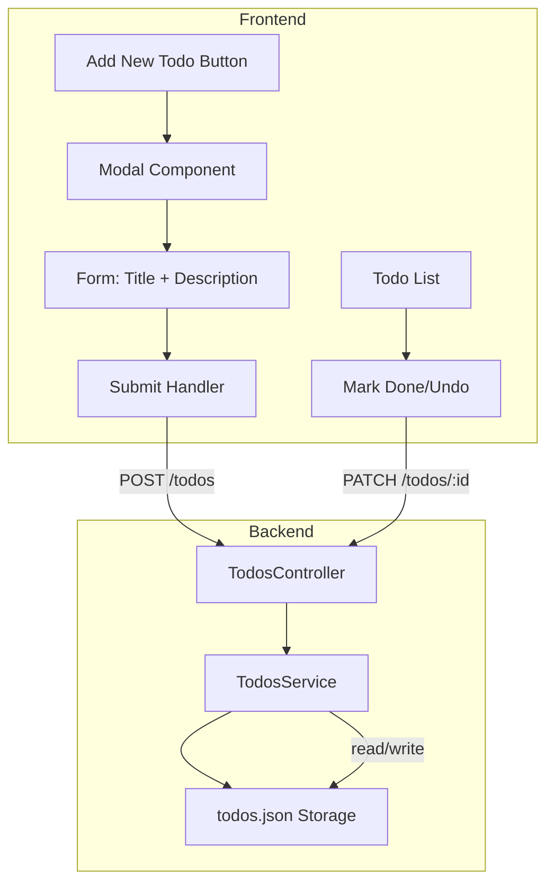
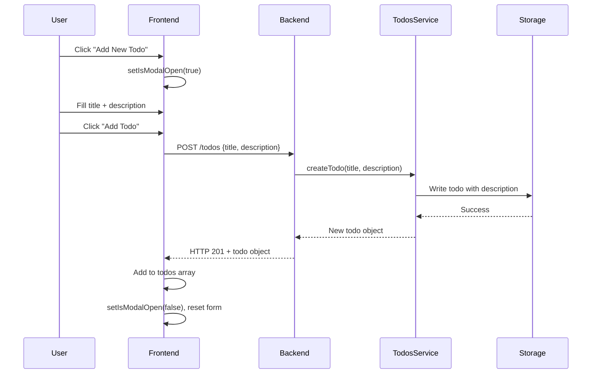

# Feature Plan: Expand Todo Items with Description and Modal

## **Executive Summary**

**What:** Enhance the todo application by adding description and completedDate fields, and replacing the inline text input with a modal dialog for creating todos.

**Why:** Users need richer todo items to capture more context beyond just a title, and the current inline input is limiting for multi-field forms.

**How:** Extend the Todo data model with two optional fields (description, completedDate), update backend API to accept and manage these fields, and build a custom modal component in React to replace the inline form.

**Impact:** Enables users to add detailed descriptions to todos and automatically track when tasks are completed. Fully backward compatible—existing todos without new fields will continue to work without migration.

**Key Changes:**
- **Backend data model** (todo.interface.ts:1-6) - Add 2 optional fields (+2 lines, HIGH impact)
- **Backend service** (todos.service.ts:20-42) - Accept description parameter, auto-manage completedDate (+5 lines, HIGH impact)
- **Frontend modal** (App.jsx) - New Modal component with form, backdrop, close handlers (+80 lines, HIGH impact)
- **Frontend styles** (App.css) - Modal styling with animations, buttons, form inputs (+150 lines, MEDIUM impact)

---

## **Requirements & Context**

### **User Requirements**
- **UR1:** Users can add an optional description when creating a todo to provide additional context or details
- **UR2:** Users can create todos with just a title (description remains optional for quick task entry)
- **UR3:** System automatically records the date/time when a todo is marked as complete
- **UR4:** When a completed todo is marked incomplete (undo), the completion date is cleared
- **UR5:** Todo creation opens a modal dialog instead of inline input, supporting multiple form fields
- **UR6:** Modal can be closed via multiple methods: X button, Cancel button, ESC key, or clicking outside

### **Technical Requirements**
- **TR1:** Backend API must accept description field in POST /todos endpoint
- **TR2:** Backend must automatically set completedDate when done=true, clear it when done=false
- **TR3:** Frontend must build custom modal component (no UI library available)
- **TR4:** Modal must prevent memory leaks from event listeners (ESC key handler cleanup)
- **TR5:** Description field not displayed in todo list view to maintain clean, scannable UI
- **TR6:** All modal close methods must reset form state to prevent stale data

### **Constraints**
- **C1:** No UI library (Material-UI, Ant Design) - must build modal from scratch using vanilla React
- **C2:** Backward compatibility required - existing todos.json has 2 todos without new fields
- **C3:** No state management library (Redux, Zustand) - use local component state only
- **C4:** No validation library on backend - implement basic validation manually

### **Out of Scope**
- Editing existing todos via modal (only creation covered)
- Displaying description text in the todo list (stored but not shown)
- Due dates or priority fields
- Todo deletion functionality

---

## **Codebase Analysis**

### **Current State**
The todo application currently uses a simple inline text input form to create todos with only a title field. Todos are stored in a JSON file with fields: id, title, done, createdAt. The frontend uses vanilla React with functional components and hooks, while the backend follows NestJS controller-service architecture.

### **Key Files/Components**

| Category | File:Line | Purpose | Impact | Lines |
|----------|-----------|---------|--------|-------|
| Data Model | backend/src/todos/todo.interface.ts:1-6 | Todo type definition | HIGH - Add 2 optional fields | +2 |
| Service | backend/src/todos/todos.service.ts:20-31 | createTodo method | HIGH - Accept description param | +2 |
| Service | backend/src/todos/todos.service.ts:33-42 | updateTodo method | HIGH - Manage completedDate | +1 |
| Controller | backend/src/todos/todos.controller.ts:14-17 | POST endpoint | MEDIUM - Accept description | +1 |
| Frontend Component | frontend/src/App.jsx:1-113 | Main App component | HIGH - Add modal, update state | +80 |
| Frontend Styles | frontend/src/App.css:1-173 | Application styles | MEDIUM - Add modal CSS | +150 |
| Data Storage | backend/data/todos.json:1-14 | JSON file storage | LOW - No changes needed | 0 |

### **Data Flow**

**Current:** User types title → clicks Add → POST /todos with {title} → service creates todo → response updates UI

**New:** User clicks "Add New Todo" button → modal opens → user fills title + description → clicks Add → POST /todos with {title, description} → service creates todo with description → response updates UI, modal closes

---

## **Design Decisions**

### **Decision 1: Description Field Optionality**

**Chosen:** Optional field (no validation requirement)
- **Rationale:** Users need flexibility to quickly add simple todos with just a title, or add detailed todos with descriptions. Requiring description would slow down the workflow for quick tasks.
- **Trade-offs:** Gains flexibility and faster task entry, sacrifices consistent data completeness (some todos will have descriptions, others won't).

**Rejected Alternative:** Required field - Would force users to always provide descriptions, creating friction for simple tasks and degrading UX.

### **Decision 2: CompletedDate Behavior on Undo**

**Chosen:** Clear completedDate when marking incomplete
- **Rationale:** The completedDate represents the current completion status. If a todo is no longer complete, having a completedDate is misleading and creates data inconsistency.
- **Trade-offs:** Gains data consistency and clear semantics, sacrifices historical tracking (can't see when it was previously completed).

**Rejected Alternative:** Preserve completedDate - Would maintain history but create confusion about what completedDate means when done=false, and complicate the data model.

### **Decision 3: Modal Implementation Approach**

**Chosen:** Custom built modal component within App.jsx
- **Rationale:** No UI library is available, and creating a simple modal from scratch is straightforward with React. Keeps dependencies minimal and provides full control over styling and behavior.
- **Trade-offs:** Gains full customization and no external dependencies, sacrifices faster development time and battle-tested accessibility features.

**Rejected Alternative:** Install UI library (e.g., Material-UI) - Would require adding dependencies to the project, increasing bundle size for a single modal component.

### **Decision 4: Description Display Strategy**

**Chosen:** Hide description in list view, store in data model only
- **Rationale:** Keeping the todo list clean and scannable is more important than showing all information. Users requested the field for internal tracking, not prominent display.
- **Trade-offs:** Gains cleaner UI and better scannability, sacrifices immediate visibility of description content.

**Rejected Alternative:** Show truncated description - Would clutter the list view and make it harder to scan, while still not showing full content.

---

## **Architecture & Design**

### **Architecture Diagram**



### **Component Design**

**Component: Modal**
- **State:** `isModalOpen: boolean`, `todoForm: {title: string, description: string}`
- **Responsibility:** Display modal overlay with form for creating todos, handle all close methods (X, Cancel, ESC, backdrop)
- **Key Logic:** useEffect for ESC key listener with cleanup, backdrop click detection, form validation (title not empty)

**Component: TodosService (Backend)**
- **Methods:** `createTodo(title, description?)`, `updateTodo(id, done)`
- **Responsibility:** Business logic for todo creation and status updates
- **Key Logic:** Auto-set completedDate to ISO timestamp when done=true, clear completedDate when done=false

**Component: TodosController (Backend)**
- **Endpoints:** POST /todos, PATCH /todos/:id
- **Responsibility:** HTTP request handling, parameter extraction
- **Key Logic:** Extract description from request body using @Body decorator, pass to service layer

### **Critical Data Flow**



---

## **Testing Strategy**

### **Manual Testing Checklist**

**Setup:**
- [ ] Start backend server: `cd backend && npm run start:dev`
- [ ] Start frontend server: `cd frontend && npm run dev`
- [ ] Open browser at http://localhost:5173

**Happy Path:**
- [ ] Click "Add New Todo" button - modal opens
- [ ] Enter title "Test Todo" and description "Test Description"
- [ ] Click "Add Todo" button - modal closes, todo appears in list
- [ ] Verify todo shows only title in list (description not visible)
- [ ] Mark todo as done - moves to "Done" column
- [ ] Check backend todos.json - verify completedDate is set
- [ ] Click Undo on completed todo - moves back to "To Do" column
- [ ] Check backend todos.json - verify completedDate is cleared

**Modal Close Methods:**
- [ ] Open modal, click X button - modal closes without creating todo
- [ ] Open modal, click Cancel button - modal closes without creating todo
- [ ] Open modal, press ESC key - modal closes without creating todo
- [ ] Open modal, click backdrop (outside modal) - modal closes without creating todo

**Validation:**
- [ ] Open modal, leave title empty, click Add Todo - nothing happens (validation prevents submission)
- [ ] Open modal, enter only title (no description), submit - todo created successfully
- [ ] Open modal, enter special characters in title/description - saves correctly

**Backwards Compatibility:**
- [ ] Existing todos without description field display correctly
- [ ] Mark existing todo as done - completedDate added successfully
- [ ] Existing todos can be undone without errors

### **Validation Commands**

```bash
# Backend verification
cd backend && npm run start:dev
# Should start without TypeScript compilation errors

# Frontend verification
cd frontend && npm run dev
# Should start and compile without errors

# API testing - Create todo with description
curl -X POST http://localhost:3000/todos \
  -H "Content-Type: application/json" \
  -d '{"title":"API Test","description":"Testing description field"}'
# Expected: Returns todo object with id, title, description, done=false, createdAt

# API testing - Mark todo as done
curl -X PATCH http://localhost:3000/todos/1765884715565 \
  -H "Content-Type: application/json" \
  -d '{"done":true}'
# Expected: Returns todo with done=true and completedDate set

# Check data file
cat backend/data/todos.json
# Expected: Valid JSON with todos including new fields
```

---

## **Implementation Plan**

### **Phase 1: Backend Data Model**
**Tasks:**
1. Update todo.interface.ts - add `description?: string` and `completedDate?: string` fields
2. Verify TypeScript compilation succeeds

**Validation:**
- TypeScript compiles without errors
- Interface exports correctly

### **Phase 2: Backend Service Layer**
**Tasks:**
1. Modify TodosService.createTodo() - add description parameter, include in new todo object
2. Modify TodosService.updateTodo() - add logic to set completedDate when done=true, clear when done=false

**Validation:**
- Service methods compile without errors
- Logic correctly handles optional description
- CompletedDate set/cleared based on done status

### **Phase 3: Backend Controller Layer**
**Tasks:**
1. Update TodosController POST endpoint - add @Body('description') parameter
2. Pass description to service.createTodo()

**Validation:**
- Controller compiles and starts successfully
- POST endpoint accepts description in request body
- API test with curl returns todo with description field

### **Phase 4: Frontend Modal Component**
**Tasks:**
1. Add modal state: isModalOpen, todoForm object
2. Create Modal component with backdrop, container, form, close handlers
3. Implement ESC key handler with useEffect cleanup
4. Replace inline form with "Add New Todo" button
5. Update createTodo function to use todoForm state and close modal on success

**Validation:**
- Modal opens when button clicked
- All four close methods work (X, Cancel, ESC, backdrop)
- Form submits and creates todo successfully
- Modal closes and form resets after submission

### **Phase 5: Frontend Styling**
**Tasks:**
1. Add modal-specific CSS classes (backdrop, container, header, form, actions)
2. Style buttons with existing color scheme
3. Add modal open animation
4. Ensure responsive design

**Validation:**
- Modal centered and styled correctly
- Animations smooth
- Matches existing design system
- No console warnings or errors

---

## **Risks & Considerations**

### **Technical Risks**

**Risk: Memory Leak from ESC Key Event Listener**
- **Probability:** Medium | **Impact:** Medium
- **Mitigation:** Use useEffect with proper cleanup function to remove event listener when modal closes
- **Contingency:** If leak occurs, debug with browser dev tools, ensure cleanup dependency array correct

**Risk: Modal Backdrop Click Handler Conflicts**
- **Probability:** Medium | **Impact:** Medium
- **Mitigation:** Check event.target.className exactly matches 'modal-backdrop' to prevent closing when clicking modal content
- **Contingency:** If modal closes unexpectedly, add stopPropagation to modal container clicks

**Risk: Existing Todos Break After Schema Change**
- **Probability:** Low | **Impact:** High
- **Mitigation:** Use optional fields (?) in TypeScript interface, handle undefined gracefully in components
- **Contingency:** If errors occur, add explicit undefined checks in rendering logic

**Risk: Form State Not Resetting Between Modal Opens**
- **Probability:** Medium | **Impact:** Low
- **Mitigation:** Always reset todoForm state when closing modal (via all close methods)
- **Contingency:** If stale data appears, audit all close handlers to ensure reset called

---

## **Migration Strategy**

**Approach:** No migration required - optional fields ensure backward compatibility.

**Backwards Compatibility:**
- Existing todos without description/completedDate will have undefined for those fields
- TypeScript optional field syntax (?) allows undefined values
- Frontend components handle undefined gracefully (no special checks needed)
- When existing todos are marked done, completedDate is added at that time

**Rollback:**
- Simply revert git commits - no data cleanup needed
- Optional fields mean old code can ignore new fields without breaking
- todos.json with new fields remains valid JSON (old code reads what it needs)

---

## **Success Criteria**

### **Definition of Done**
- [ ] Backend Todo interface includes description and completedDate as optional fields
- [ ] POST /todos endpoint accepts and stores description field
- [ ] PATCH /todos/:id automatically sets completedDate when done=true
- [ ] PATCH /todos/:id clears completedDate when done=false
- [ ] Frontend displays "Add New Todo" button instead of inline form
- [ ] Clicking button opens modal with title input and description textarea
- [ ] Modal closes via X button, Cancel button, ESC key, and backdrop click
- [ ] Creating todo with description works correctly
- [ ] Creating todo without description (title only) works correctly
- [ ] Modal closes and form resets after successful submission
- [ ] Existing todos without new fields display and function correctly
- [ ] No TypeScript compilation errors in backend or frontend
- [ ] No console errors or warnings in browser
- [ ] All manual test checklist items pass

### **Key Metrics**
- 100% of newly created todos include createdAt timestamp
- 100% of completed todos have completedDate set
- 0% of incomplete todos have completedDate set
- Total lines changed: ~240 lines (+2 backend interface, +4 backend service/controller, +80 frontend component, +150 frontend CSS, +4 refactoring)

---

## **Future Enhancements**

**Potential Improvements:**
1. Display description on hover tooltip in todo list for quick preview
2. Add edit modal to modify title/description of existing todos
3. Add delete functionality with confirmation modal
4. Add due date field with date picker
5. Add priority levels (low/medium/high) with color coding
6. Extract Modal as reusable component for future forms
