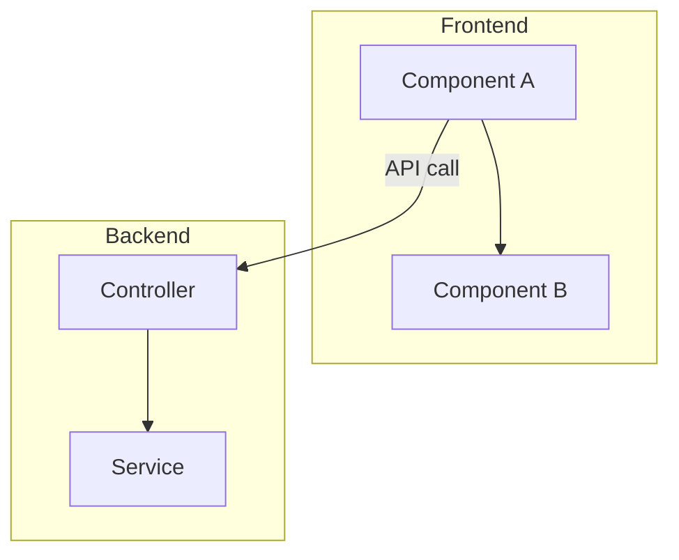
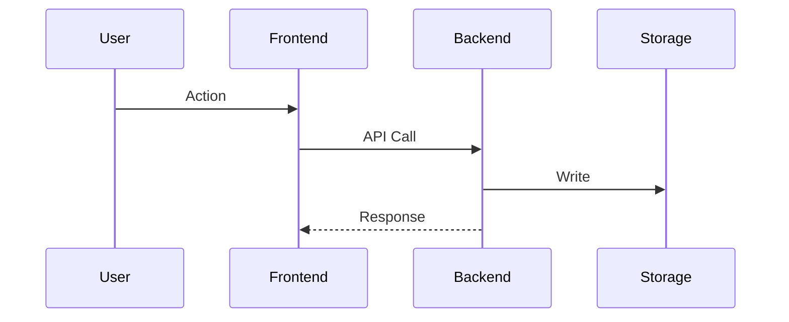

# Feature Plan: [FEATURE_NAME]

<!--
TARGET LENGTH: 400-600 lines for simple features, 600-800 for complex features
INFORMATION DENSITY: Every line must add unique value. Avoid repetition between sections.
-->

## **Executive Summary** [REQUIRED] (~15 lines)

**What:** [1 sentence - what's being built]

**Why:** [1 sentence - problem being solved]

**How:** [1-2 sentences - core technical approach]

**Impact:** [1-2 sentences - key outcomes, backwards compatibility]

**Key Changes:**
- [3-5 bullet points - specific file changes with impact]

---

## **Requirements & Context** [REQUIRED] (~40 lines)

### **User Requirements**
- **UR1:** [Specific user need with acceptance criteria]
- **UR2:** [Another requirement]
- **UR3-5:** [3-5 total, use numbering for reference]

### **Technical Requirements**
- **TR1:** [Key technical constraint or dependency]
- **TR2:** [Another requirement]
- **TR3-6:** [Keep to 3-6 items, numbered for reference]

### **Constraints**
- **C1:** [Critical constraint only - e.g., backwards compatibility, no database]
- **C2-3:** [2-4 constraints max, only significant ones]

### **Out of Scope** [ONLY if unclear]
- [3-5 items max, only if needed to prevent scope creep]

---

## **Codebase Analysis** [REQUIRED] (~35 lines)

### **Current State** (2-3 sentences)
[How system works today, key limitation being addressed]

### **Key Files/Components** (TABLE FORMAT - CRITICAL)

| Category | File:Line | Purpose | Impact | Lines |
|----------|-----------|---------|--------|-------|
| Data Model | backend/src/todos/todo.interface.ts:1-6 | Todo type definition | HIGH - Add 2 fields | +2 |
| Service | backend/src/todos/todos.service.ts:20-31 | createTodo() | HIGH - Accept new param | ~5 |
| Controller | backend/src/todos/todos.controller.ts:14-17 | POST endpoint | MEDIUM - Update body | ~2 |
| Frontend | frontend/src/App.jsx:67-76 | Input form | HIGH - Replace with modal | +80 |

**Format:**
- Use `file:line` or `file:line-range` for precision
- Impact: HIGH (major changes) / MEDIUM (moderate) / LOW (minor)
- Lines: Estimate changed/added lines (+/- prefix)

### **Data Flow**
**Current:** [Brief flow, 1 line]
**New:** [Brief flow showing key change, 1 line]

---

## **Design Decisions** [REQUIRED] (~50 lines)

### **Decision 1: [Name of Key Decision]**

**Chosen:** [Approach name]
- **Rationale:** [2-3 sentences why this approach]
- **Trade-offs:** Gains [X], sacrifices [Y]

**Rejected Alternative:** [ONE alternative] - [1 sentence why rejected]

### **Decision 2-4:** [Repeat for 3-4 KEY decisions only]

**Rules:**
- Only include decisions with multiple valid approaches
- ONE rejected alternative per decision (not 3-4)
- Avoid obvious decisions ("should we test?" - yes, don't document)

---

## **Architecture & Design** [REQUIRED] (~80 lines)

### **Architecture Diagram** [1 diagram only]



### **Component Design** (compress, 3-5 lines per component)

**Component: [Name]**
- **Props/Params:** `isOpen: bool, onClose: func, data: obj`
- **Responsibility:** [1 sentence]
- **Key Logic:** [1 sentence about validation/transformation/etc]

### **Critical Data Flow** [ONE sequence diagram if helpful, otherwise skip]



**Rules:**
- 1-2 diagrams MAX (architecture + optional sequence)
- NO ER diagrams for simple changes (describe in text)
- NO state machines unless complex state (e.g., multi-step wizards)
- Diagrams must add value text cannot convey

---

## **Testing Strategy** [REQUIRED] (~50 lines)

### **Manual Testing Checklist** (15-20 items)
**Setup:**
- [ ] [Start backend/frontend]

**Happy Path:**
- [ ] [Key user flow 1]
- [ ] [Key user flow 2]

**Validation:**
- [ ] [Error case 1]
- [ ] [Edge case 1]

**Backwards Compatibility:**
- [ ] [Test with existing data]

### **Validation Commands**
```bash
# Backend verification
cd backend && npm run build && npm test

# Frontend verification
cd frontend && npm run build

# API testing
curl -X POST http://localhost:3000/api/endpoint \
  -H "Content-Type: application/json" \
  -d '{"field":"value"}'
```

---

## **Implementation Plan** [REQUIRED] (~70 lines)

### **Phase 1: [Name]** (e.g., Backend Changes)
**Tasks:**
1. [Specific task with file reference]
2. [Another task]

**Validation:** [2-3 key checks before moving to next phase]

### **Phase 2-4:** [3-5 phases total]
[Same structure, keep each phase to 15-20 lines]

**Rules:**
- NO separate "Objectives" section (tasks imply objectives)
- NO "Estimated Time" (unhelpful for LLMs)
- Validation criteria: 2-3 items max per phase

---

## **Risks & Considerations** [REQUIRED] (~35 lines)

### **Technical Risks** [HIGH and MEDIUM priority only]

**Risk: [Name]**
- **Probability:** [High/Medium] | **Impact:** [High/Medium]
- **Mitigation:** [What prevents it]
- **Contingency:** [Fallback if it happens]

[2-4 risks total - only realistic ones]

**Rules:**
- NO low-probability risks (waste of space)
- NO "Business Risks" section unless critical
- NO "Dependencies" section (cover in Technical Requirements)
- NO "Technical Debt" section for simple features

---

## **Migration Strategy** [ONLY if data/breaking changes] (~15 lines)

**Approach:** [1 sentence - e.g., "Optional fields = no migration needed"]

**Backwards Compatibility:** [How old data/clients handled]

**Rollback:** [Brief - usually "git revert" or restore backup]

**Rules:**
- Skip this section if no data migration or breaking changes
- NO multi-step deployment procedures for simple changes
- NO "feature flags" discussion if not using them
- Keep to 10-20 lines MAX

---

## **Success Criteria** [REQUIRED] (~20 lines)

### **Definition of Done**
- [ ] [Specific technical completion criteria]
- [ ] [Key functionality works]
- [ ] [Tests pass]
- [ ] [No console errors]
[8-12 items - concrete and verifiable]

### **Key Metrics**
- [1-2 quantitative metrics if relevant, e.g., "100% of new records have field X"]
- [Total lines changed: ~400 lines]

**Rules:**
- Skip overly specific metrics ("< 100ms load time") unless critical
- Focus on functional completeness, not performance (unless perf feature)

---

## **Future Enhancements** [OPTIONAL] (~10 lines)

**Potential Improvements:**
1. [Enhancement 1]
2. [Enhancement 2]
3-6. [5-6 items MAX]

**Rules:**
- Keep this section SHORT (10 lines max)
- NO categorization (Performance/Code Quality/etc) - just a simple list
- Skip entirely if nothing significant to add

---

## **Template Usage Guide**

### **Brevity Principles**
1. **No redundancy:** Each section should contain unique information
2. **No obvious points:** Skip items like "test the code" or "use git"
3. **Compress alternatives:** 1 rejected option per decision, not 3-4
4. **Focus on HIGH impact:** Skip low-probability risks and minor details
5. **Diagrams are expensive:** Use 1-2 max, only when they clarify complexity
6. **Tables over prose:** File changes, requirements should use structured formats

### **Section Tags**
- **[REQUIRED]:** Always include, regardless of feature size
- **[CONDITIONAL]:** Include only if applicable (e.g., Migration for breaking changes)
- **[OPTIONAL]:** Include only if adds significant value

### **When to Skip Sections**
- **Migration Strategy:** Skip if no data changes or breaking changes
- **Out of Scope:** Skip if scope is clear from requirements
- **Future Enhancements:** Skip if no obvious next steps
- **Sequence Diagrams:** Skip if data flow is simple/obvious
- **Business Risks:** Skip unless critical business impact

### **Word Count Targets by Feature Complexity**

| Feature Type | Target Lines | Example |
|--------------|--------------|---------|
| Simple enhancement | 350-450 | Add field to model, update UI to display |
| Medium feature | 450-600 | New modal with form, API changes, validation |
| Complex feature | 600-800 | Multi-step workflow, state management, integrations |
| Major initiative | 800-1000 | Multiple subsystems, migrations, architecture changes |

**If you exceed these targets, you're likely:**
- Including too many alternatives per decision (keep to 1)
- Documenting low-probability risks
- Adding unnecessary sections (migration when no data changes)
- Using too many diagrams (1-2 max)
- Repeating information across sections

### **High-Value Elements (Never Skip)**
1. ✅ Specific line references in file table (`file.ts:20-31`)
2. ✅ Impact ratings (HIGH/MEDIUM/LOW) for changes
3. ✅ Structured requirement numbering (UR1, TR1, C1)
4. ✅ Manual testing checklist with concrete steps
5. ✅ Phase-by-phase implementation with validation
6. ✅ 1 architecture diagram showing key components
7. ✅ Design decision rationales (but only 3-4 decisions)

### **Low-Value Elements (Skip/Minimize)**
1. ❌ Multiple rejected alternatives (1 per decision suffices)
2. ❌ Low-probability risk analysis
3. ❌ Obvious constraints ("must use TypeScript" when already using it)
4. ❌ Verbose migration procedures for simple changes
5. ❌ "Not needed" discussions (feature flags, versioning when not applicable)
6. ❌ Exhaustive future enhancements (keep to 5-6 items)
7. ❌ Technical debt section for simple features
8. ❌ Multiple sequence/state diagrams

---

**Remember:** Information density > length. Every line should answer "what", "where", "how", or "why" with specificity. Avoid abstract descriptions.
