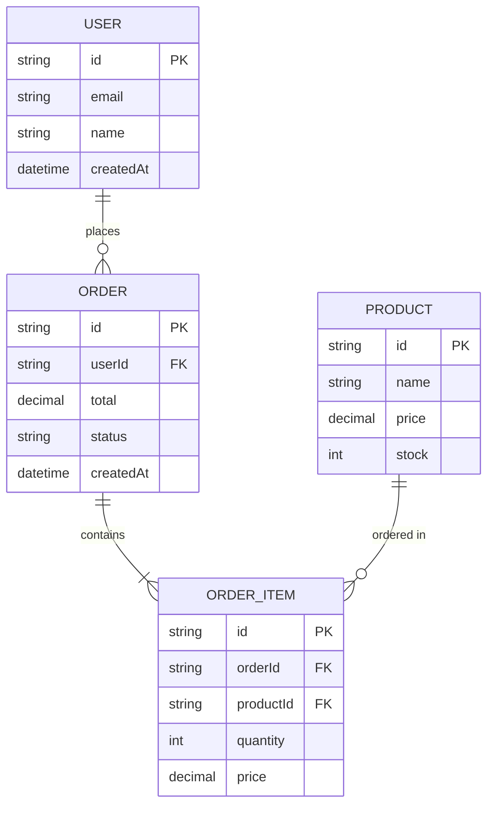
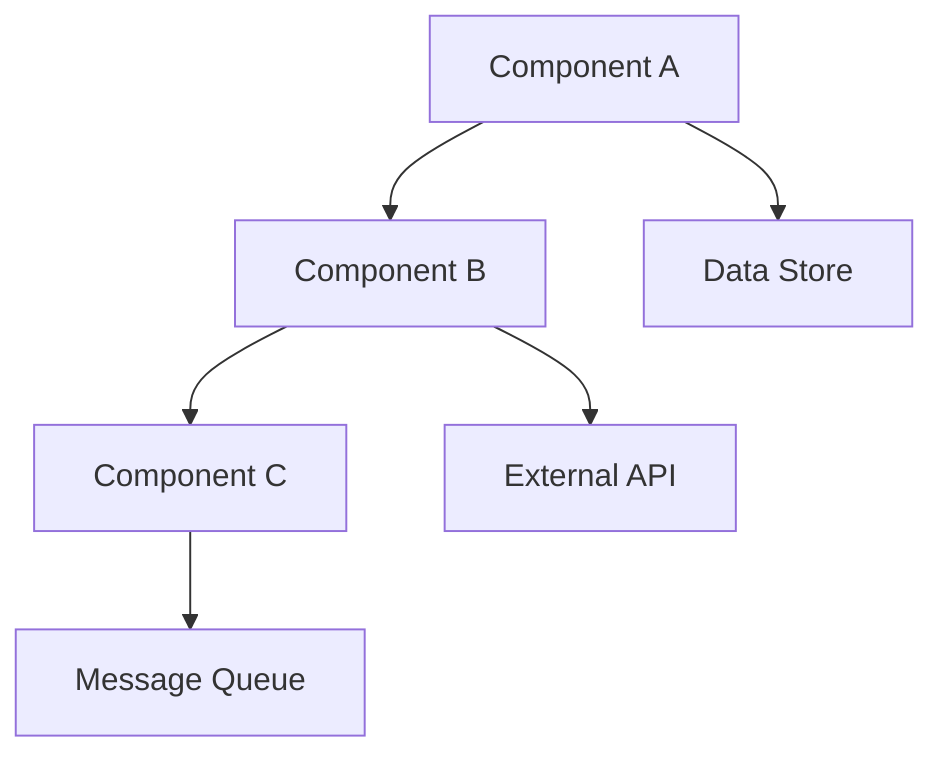
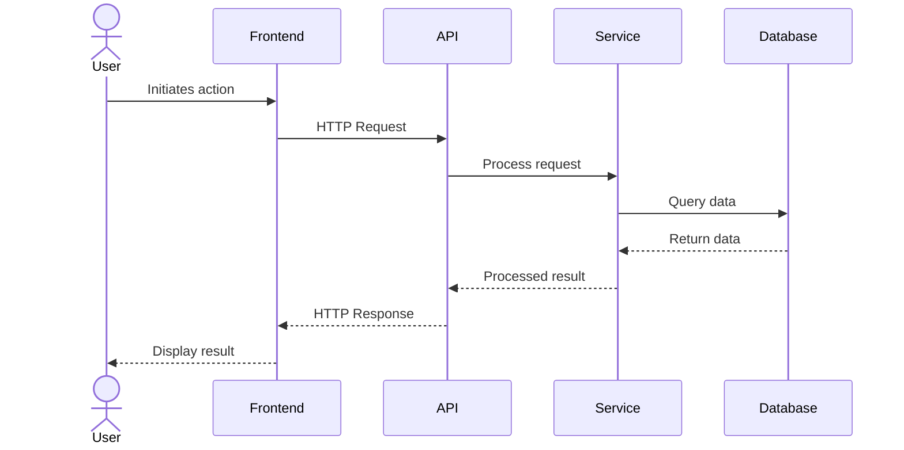
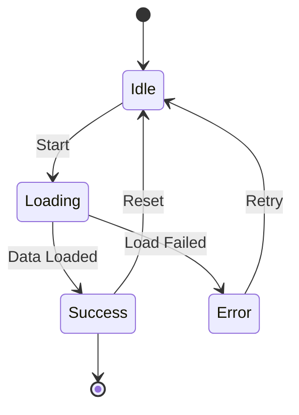

# Feature Plan Template for feat-dev-plan Command

## Template Purpose
This template ensures consistent, high-quality feature planning documentation across all technical domains (frontend, backend, API, infrastructure, data pipelines, security, performance, etc.).

---

# Feature Plan: [FEATURE_NAME]

## **Executive Summary** [REQUIRED]
*Concise overview of the feature in 3-5 paragraphs*

**What:** Brief description of what will be built/changed
**Why:** Business/technical problem being solved
**How:** High-level approach (no implementation details)
**Impact:** Expected outcomes and benefits

**Key Changes:**
- Bullet list of 3-5 most important changes
- Focus on user-visible or architectural impacts
- Include any breaking changes or migrations

---

## **Requirements & Context** [REQUIRED]

### **User Requirements** [REQUIRED]
*What users need and expect from this feature*
- User story format: "As a [user], I need [capability] so that [benefit]"
- Acceptance criteria: measurable success conditions
- User workflows affected

### **Business Requirements** [REQUIRED]
*Business rules, compliance, and organizational needs*
- Business rules and constraints
- Compliance/regulatory requirements (if any)
- Performance targets (SLA, response times, throughput)
- Cost/resource constraints

### **Technical Requirements** [REQUIRED]
*Technical specifications and constraints*
- Technology stack components involved
- Integration requirements (APIs, services, databases)
- Scalability requirements
- Security requirements
- Platform/environment constraints

### **Constraints** [REQUIRED]
*Limitations that affect the solution*
- Technical debt that limits options
- Backward compatibility requirements
- Resource limitations (time, budget, expertise)
- External dependencies or blockers

### **Out of Scope** [OPTIONAL]
*Explicitly state what this feature will NOT do*
- Features intentionally excluded
- Future enhancements not in this iteration
- Related work tracked separately

---

## **Codebase Analysis** [REQUIRED]

### **Current Implementation** [REQUIRED]
*How the system currently works in the area being modified*
- Existing architecture/patterns in affected areas
- Key components and their responsibilities
- Current data flow or process flow
- Existing limitations being addressed

### **Key Files/Components** [REQUIRED]
*Specific code locations with purpose*
```
Category | File/Component | Purpose | Impact
---------|----------------|---------|--------
[Core]   | path/to/file:line | What it does | How it changes
[API]    | path/to/endpoint | Current behavior | Modifications needed
[Data]   | schema/table | Current structure | Migration required
```

### **Integration Points** [REQUIRED]
*How this feature connects with existing systems*
- **Upstream dependencies:** What this feature depends on
- **Downstream impacts:** What depends on this feature
- **External integrations:** Third-party services, APIs
- **Data flow:** Current → New flow comparison

### **Existing Patterns** [CONDITIONAL - Required if modifying existing code]
*Patterns to follow for consistency*
- Architectural patterns used (MVC, microservices, event-driven)
- Code conventions and standards
- Error handling patterns
- Testing patterns

---

## **Design Decisions** [REQUIRED]

### **Approach Selection** [REQUIRED]
*The chosen approach with rationale*

**Option Chosen:** [Name of approach]
- **Description:** What this approach entails
- **Rationale:** Why this was selected
- **Trade-offs:** What we gain vs. what we sacrifice

**Alternatives Considered:**
1. **Option A:** [Brief description]
   - Pros: [Benefits]
   - Cons: [Drawbacks]
   - Rejected because: [Specific reason]

2. **Option B:** [Brief description]
   - Pros: [Benefits]
   - Cons: [Drawbacks]
   - Rejected because: [Specific reason]

### **Data Model Changes** [CONDITIONAL - Required if data structures change]
*Changes to data structures, schemas, or storage*

**Change Details:**
- **New fields/tables:** Purpose and constraints
- **Modified fields:** Before → After with migration strategy
- **Removed fields:** Deprecation plan
- **Data migration strategy:** How existing data is handled

**Entity Relationship Diagram (optional):**


**ER Diagram notation:**
- `||--o{` : One to many
- `||--||` : One to one
- `}o--o{` : Many to many
- `PK` : Primary Key
- `FK` : Foreign Key

### **API Changes** [CONDITIONAL - Required if APIs are modified]
*Changes to internal or external APIs*
- **New endpoints:** Method, path, purpose, request/response
- **Modified endpoints:** Changes and backward compatibility
- **Deprecated endpoints:** Timeline and migration path
- **Breaking changes:** Version strategy

### **Frontend Changes** [CONDITIONAL - Required if UI is modified]
*User interface and experience changes*
- **Components:** New/modified components and their purpose
- **State management:** Changes to application state
- **User workflows:** How user interactions change
- **Accessibility:** WCAG compliance approach
- **Responsive design:** Mobile/tablet considerations

### **Infrastructure Changes** [CONDITIONAL - Required if infrastructure is modified]
*Changes to deployment, scaling, or operations*
- **Resource requirements:** CPU, memory, storage changes
- **Configuration changes:** Environment variables, secrets
- **Deployment changes:** CI/CD pipeline modifications
- **Monitoring/logging:** New metrics or log patterns

### **Security Considerations** [CONDITIONAL - Required if security-sensitive]
*Security implications and mitigations*
- **Authentication/Authorization:** Changes to access control
- **Data protection:** Encryption, PII handling
- **Input validation:** Sanitization approach
- **Audit logging:** What needs to be logged

---

## **Architecture & Design** [REQUIRED]

### **High-Level Architecture** [REQUIRED]
*Visual representation of the solution architecture using Mermaid diagrams*



**Alternative diagram types:**
- Use `graph LR` for left-to-right flow
- Use `graph TD` for top-down flow
- Use `flowchart` for more advanced features (subgraphs, styling)

### **Component Design** [REQUIRED]
*Detailed design of new or modified components*

**Component: [Name]**
- **Purpose:** Single responsibility
- **Inputs:** What it receives
- **Outputs:** What it produces
- **Dependencies:** What it needs to function
- **Error handling:** Failure scenarios and recovery

### **Data Flow** [REQUIRED]
*How data moves through the system*
1. **Input stage:** How data enters the system
2. **Processing stage:** Transformations and business logic
3. **Storage stage:** Where and how data is persisted
4. **Output stage:** How data is presented or transmitted

### **Sequence Diagrams** [OPTIONAL]
*For complex interactions using Mermaid sequence diagrams*



**Sequence diagram features:**
- Use `-->>` for dashed return arrows
- Use `activate`/`deactivate` to show lifeline activation
- Use `Note over` or `Note right/left of` for annotations
- Use `alt`/`else`/`opt` for conditional flows
- Use `loop` for repeated operations

### **State Management** [CONDITIONAL - Required for stateful systems]
*How state is managed and synchronized*

**State Details:**
- State storage approach
- State transitions and validation
- Consistency guarantees
- Cache invalidation strategy

**State Diagram (optional):**


---

## **Testing Strategy** [REQUIRED]

### **Test Plan** [REQUIRED]
*Comprehensive testing approach*

**Unit Tests:**
- Key functions/methods to test
- Edge cases and boundary conditions
- Mocking strategy for dependencies

### **Manual Testing Checklist** [REQUIRED]
*Step-by-step manual verification*
- [ ] Setup steps and prerequisites
- [ ] Happy path scenarios
- [ ] Error scenarios
- [ ] Edge cases
- [ ] Rollback/recovery scenarios

### **Validation Commands** [REQUIRED]
*Commands to verify the implementation*
```bash
# Build verification
[build commands and expected output]

# Functionality verification
[test commands and expected results]

# Data verification
[queries or checks to validate data]
```

## **Implementation Plan** [REQUIRED]
*Phased approach for complex features*

### **Phase 1: [Name]**
- Objectives and deliverables
- Dependencies and prerequisites
- Validation criteria

### **Phase 2: [Name]**
- Objectives and deliverables
- Dependencies on Phase 1
- Validation criteria

---

## **Risks & Considerations** [REQUIRED]

### **Technical Risks** [REQUIRED]
*Technical challenges and mitigations*

**Risk: [Name]**
- **Description:** What could go wrong
- **Probability:** High/Medium/Low
- **Impact:** High/Medium/Low
- **Mitigation:** How to prevent or handle
- **Contingency:** Fallback plan if risk materializes

### **Business Risks** [REQUIRED]
*Business impact and mitigations*
- User experience degradation
- Data loss or corruption possibilities
- Service availability impacts
- Compliance or legal risks

### **Dependencies** [REQUIRED]
*External factors that could affect delivery*
- Third-party service dependencies
- Team dependencies
- Timeline dependencies
- Resource dependencies

### **Technical Debt** [OPTIONAL]
*Debt incurred or addressed*
- New debt being introduced (and why it's acceptable)
- Existing debt being paid down
- Future refactoring needed

---

## **Migration Strategy** [CONDITIONAL - Required if existing data/systems need migration]

### **Migration Plan**
*How to transition from current to new state*
- Pre-migration checklist
- Migration steps (automated vs manual)
- Rollback procedure
- Data validation approach
- Downtime requirements (if any)

### **Backward Compatibility**
*How compatibility is maintained*
- Deprecation timeline
- Dual support period
- Feature flags approach
- Communication plan to users

---

## **Documentation Requirements** [OPTIONAL]

### **User Documentation**
- User guides or tutorials needed
- API documentation updates
- Configuration documentation

### **Technical Documentation**
- Architecture decision records (ADRs)
- Runbook updates
- Deployment guides

---

## **Success Criteria** [REQUIRED]

### **Definition of Done** [REQUIRED]
*Checklist for feature completion*
- [ ] All code implemented and reviewed
- [ ] All tests passing (unit, integration, e2e)
- [ ] Documentation updated
- [ ] Performance benchmarks met
- [ ] Security review completed (if required)
- [ ] Accessibility standards met (if UI)
- [ ] Monitoring/alerts configured (if production)

### **Success Metrics** [REQUIRED]
*How to measure success post-deployment*
- Quantitative metrics (response time < Xms, error rate < Y%)
- Qualitative metrics (user satisfaction, developer experience)
- Business metrics (conversion rate, cost reduction)

## **Future Enhancements** [OPTIONAL]
*Potential improvements not in current scope*
- Enhancements identified during planning
- Performance optimizations possible later
- Additional features that could build on this
- Technical debt to address in future

---

## Template Usage Guidelines

### REQUIRED Sections
Must be included in every plan:
- Executive Summary
- Requirements & Context (all subsections)
- Codebase Analysis (all subsections)
- Design Decisions (Approach Selection)
- Architecture & Design (High-Level, Component, Data Flow)
- Testing Strategy (Test Plan, Manual Checklist, Validation Commands)
- Risks & Considerations (Technical Risks, Business Risks, Dependencies)
- Success Criteria (Definition of Done, Success Metrics)

### CONDITIONAL Sections
Include when applicable to the feature:
- **Data Model Changes** - When modifying data structures
- **API Changes** - When modifying endpoints
- **Frontend Changes** - When modifying UI
- **Infrastructure Changes** - When modifying deployment/operations
- **Security Considerations** - When handling sensitive data or access control
- **State Management** - For stateful systems
- **Performance Testing** - For performance-critical features
- **Migration Strategy** - When transitioning existing data/systems
- **Monitoring & Observability** - For production systems

### OPTIONAL Sections
Include for additional clarity when beneficial:
- Out of Scope
- Sequence Diagrams
- Implementation Plan (for phased delivery)
- Technical Debt
- Documentation Requirements
- Rollout Strategy
- Future Enhancements

### Section Completeness Guidelines

1. **Be Specific:** Use actual file paths, line numbers, and component names
2. **Explain Rationale:** Always explain WHY decisions were made
3. **Consider Alternatives:** Document options considered and why they were rejected
4. **Identify Risks:** Be honest about what could go wrong
5. **Define Success:** Make success criteria measurable and objective
6. **Plan for Failure:** Include rollback and recovery strategies
7. **Think Long-term:** Consider maintenance and future enhancements

### Quality Checklist for Plan Review

Before finalizing a plan, ensure:
- [ ] All REQUIRED sections are complete
- [ ] All applicable CONDITIONAL sections are included
- [ ] Technical decisions have rationale
- [ ] Risks have mitigations
- [ ] Success criteria are measurable
- [ ] Testing strategy covers edge cases
- [ ] File paths and line numbers are specific
- [ ] Someone unfamiliar with the codebase could implement from this plan
