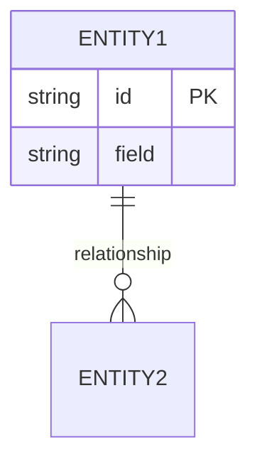
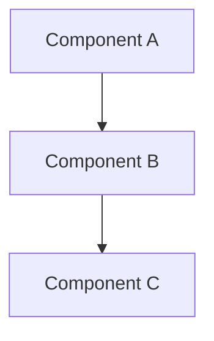
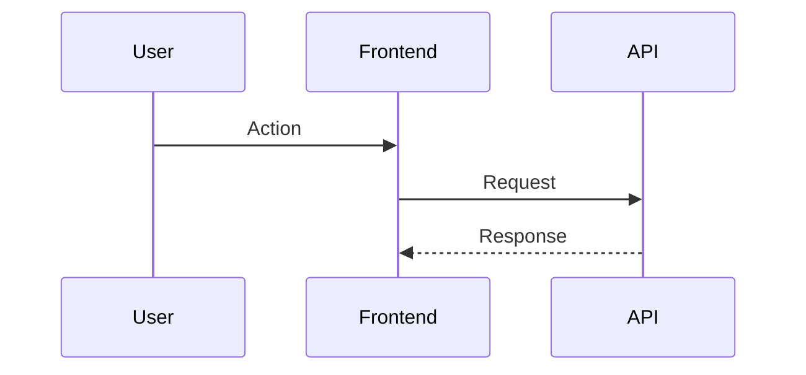
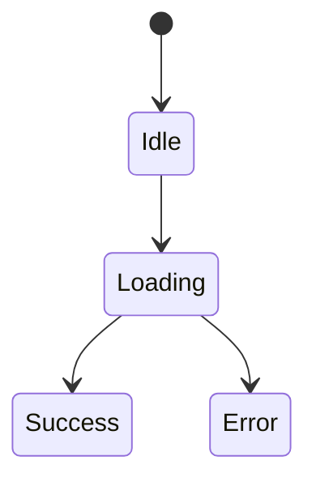

# Feature Plan: [FEATURE_NAME]

## **Executive Summary** [REQUIRED]

**What:** [Brief description]

**Why:** [Problem being solved]

**How:** [High-level approach]

**Impact:** [Expected outcomes]

**Key Changes:**
- [Change 1]
- [Change 2]

---

## **Requirements & Context** [REQUIRED]

### **User Requirements**
- [User story or need]
- [Acceptance criteria]

### **Business Requirements**
- [Business rules and constraints]
- [Performance targets]

### **Technical Requirements**
- [Technology stack components]
- [Integration requirements]

### **Constraints**
- [Technical limitations]
- [Backward compatibility needs]

### **Out of Scope** [OPTIONAL]
- [What this won't do]

---

## **Codebase Analysis** [REQUIRED]

### **Current Implementation**
- [How system currently works]
- [Existing limitations]

### **Key Files/Components**
```
Category | File/Component | Purpose | Impact
---------|----------------|---------|--------
[Core]   | path/to/file:line | [What it does] | [How it changes]
```

### **Integration Points**
- **Upstream dependencies:** [What this depends on]
- **Downstream impacts:** [What depends on this]
- **Data flow:** [Current → New]

### **Existing Patterns** [CONDITIONAL]
- [Architectural patterns to follow]
- [Code conventions]

---

## **Design Decisions** [REQUIRED]

### **Approach Selection**

**Option Chosen:** [Name]
- **Description:** [What this entails]
- **Rationale:** [Why selected]
- **Trade-offs:** [Gains vs sacrifices]

**Alternatives Considered:**
1. **[Option A]:** [Description] - Rejected because: [reason]
2. **[Option B]:** [Description] - Rejected because: [reason]

### **Data Model Changes** [CONDITIONAL]
- **New fields/tables:** [Purpose]
- **Modified fields:** [Before → After]
- **Migration strategy:** [How existing data handled]



### **API Changes** [CONDITIONAL]
- **New endpoints:** [Method, path, purpose]
- **Modified endpoints:** [Changes]
- **Breaking changes:** [Version strategy]

### **Frontend Changes** [CONDITIONAL]
- **Components:** [New/modified components]
- **State management:** [Changes]
- **User workflows:** [How interactions change]

### **Infrastructure Changes** [CONDITIONAL]
- **Resource requirements:** [CPU, memory, storage]
- **Configuration changes:** [Environment variables]
- **Deployment changes:** [CI/CD modifications]

### **Security Considerations** [CONDITIONAL]
- **Authentication/Authorization:** [Access control changes]
- **Data protection:** [Encryption, PII handling]
- **Input validation:** [Sanitization approach]

---

## **Architecture & Design** [REQUIRED]

### **High-Level Architecture**



### **Component Design**

**Component: [Name]**
- **Purpose:** [Responsibility]
- **Inputs:** [What it receives]
- **Outputs:** [What it produces]
- **Dependencies:** [What it needs]

### **Data Flow**
1. **Input:** [How data enters]
2. **Processing:** [Transformations]
3. **Storage:** [Persistence]
4. **Output:** [Presentation]

### **Sequence Diagrams** [OPTIONAL]



### **State Management** [CONDITIONAL]

**State Details:**
- [Storage approach]
- [State transitions]



---

## **Testing Strategy** [REQUIRED]

### **Test Plan**

**Unit Tests:**
- [Key functions to test]
- [Edge cases]

### **Manual Testing Checklist**
- [ ] [Setup steps]
- [ ] [Happy path scenarios]
- [ ] [Error scenarios]

### **Validation Commands**
```bash
# Build verification
[build command]

# Functionality verification
[test command]
```

## **Implementation Plan** [REQUIRED]

### **Phase 1: [Name]**
- [Objectives]
- [Validation criteria]

### **Phase 2: [Name]**
- [Objectives]
- [Validation criteria]

---

## **Risks & Considerations** [REQUIRED]

### **Technical Risks**

**Risk: [Name]**
- **Probability:** [High/Medium/Low]
- **Impact:** [High/Medium/Low]
- **Mitigation:** [Prevention]
- **Contingency:** [Fallback]

### **Business Risks**
- [User experience impacts]
- [Data loss possibilities]

### **Dependencies**
- [Third-party dependencies]
- [Team dependencies]

### **Technical Debt** [OPTIONAL]
- [New debt introduced]
- [Debt being paid down]

---

## **Migration Strategy** [CONDITIONAL]

### **Migration Plan**
- [Pre-migration checklist]
- [Migration steps]
- [Rollback procedure]

### **Backward Compatibility**
- [Deprecation timeline]
- [Feature flags]

---

## **Documentation Requirements** [OPTIONAL]

### **User Documentation**
- [Guides needed]

### **Technical Documentation**
- [ADRs needed]

---

## **Success Criteria** [REQUIRED]

### **Definition of Done**
- [ ] Code implemented and reviewed
- [ ] All tests passing
- [ ] Documentation updated
- [ ] Performance benchmarks met

### **Success Metrics**
- [Quantitative metrics]
- [Business metrics]

## **Future Enhancements** [OPTIONAL]
- [Potential improvements]
- [Performance optimizations]

---

## Template Sections

### REQUIRED (always include):
- Executive Summary, Requirements & Context, Codebase Analysis, Design Decisions (Approach Selection), Architecture & Design, Testing Strategy, Risks & Considerations, Success Criteria, Implementation Plan

### CONDITIONAL (include when applicable):
- Data Model Changes, API Changes, Frontend Changes, Infrastructure Changes, Security Considerations, State Management, Migration Strategy, Existing Patterns

### OPTIONAL (for additional clarity):
- Out of Scope, Sequence Diagrams, Technical Debt, Documentation Requirements, Future Enhancements
